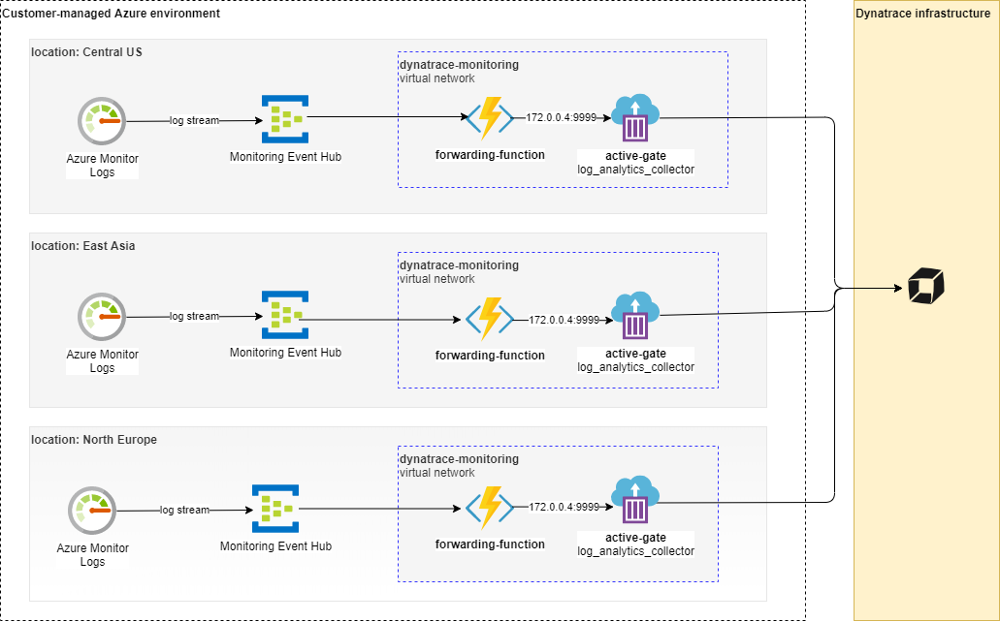

# Architecture

azure-log-forwarder-function is an Azure Function App written in Python that stream logs for configured services. The Function execution is triggered by Azure Event Hub. Once all log records are processed, they are pushed to Dynatrace Logs API.   

`azure-log-forwarder` (with containerized ActiveGate)  components:
* `azure-log-forwarder-function` - function app that subscribes to one Event Hub which is in the same location where you deploy azure-log-forwarder; deployment with App Service Plan and minimum `S1 Standard` pricing tier 
* `azure-log-forwarder-container` - container instances that provides Dynatrace ActiveGate proxy to Dynatrace Infrastructure. This is Azure Container Instance with 1 core, 1.5 GB ram assigned
* `azure-log-forwarder-vnet` - virtual network to ensure private communication between function and active-gate

You need to deploy azure-log-forwarder in each region you want to stream logs from.

